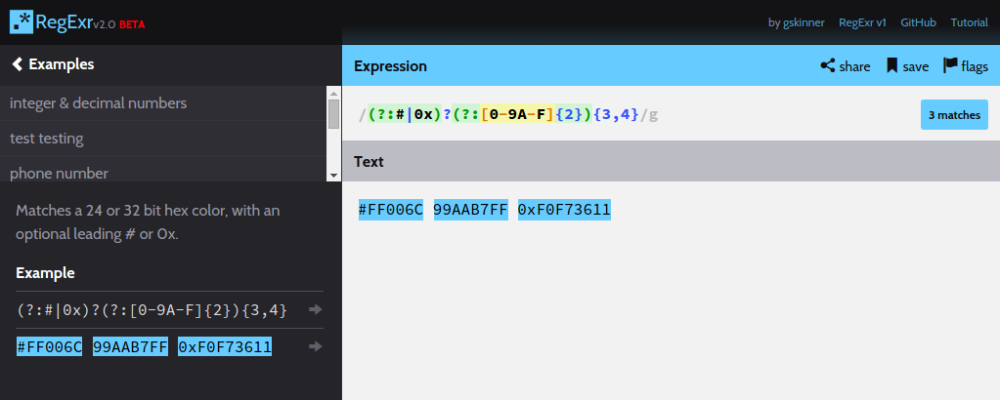

# Gallery - azk buttons

<!-- MarkdownTOC -->

- [Stringer](#stringer)
    + RSS reader
    + ruby, postgres, sinatra
- [Dillinger](#dillinger)
    + Markdown editor
    + node, express, ejs, angular, markdown-it
- [Huginn](#huginn)
    + Local agents
    + ruby, rails, mysql
- [Regexr](#regexr)
    + Regular expressions
    + node, ruby, compass, sass
- [Shout](#shout)
    + IRC client
    + node, express, socket.io, slate-irc
- [Feedbin](#feedbin)
    + RSS reader
    + ruby, rails, clockwork, sidekiq, redis, postgres, elasticsearch, memcached
- [Reportr](#dashboard)
    + Personal dashboard
    + node, mongo, redis, express, kue

<!-- /MarkdownTOC -->

----------------------

## [Stringer](https://github.com/azk-button/stringer/tree/azkfile)

A self-hosted, anti-social RSS reader.
Check [Azkfile.js](https://github.com/azk-button/stringer/blob/azkfile/Azkfile.js) and [Azkfile.md](https://github.com/azk-button/stringer/blob/azkfile/Azkfile.md) for more info.

`ruby, postgres, sinatra`

----------------------

## [Dillinger](https://github.com/azk-button/dillinger/tree/azkfile)

The last Markdown editor, ever.
Check [Azkfile.js](https://github.com/azk-button/dillinger/blob/azkfile/Azkfile.js) and [Azkfile.md](https://github.com/azk-button/dillinger/blob/azkfile/Azkfile.md) for more info.

`node, express, ejs, angular, markdown-it`

----------------------

## [Huginn](https://github.com/azk-button/huginn/tree/azkfile)

Huginn is a system for building agents that perform automated tasks for you online.  They can read the web, watch for events, and take actions on your behalf.  Huginn's Agents create and consume events, propagating them along a directed graph.  Think of it as a hackable Yahoo! Pipes plus IFTTT on your own server.  You always know who has your data.  You do.
Check [Azkfile.js]() and [Azkfile.md](https://github.com/azk-button/huginn/blob/azkfile/Azkfile.md) for more info.

`ruby, rails, mysql`

----------------------

## [Regexr](https://github.com/azk-button/regexr/tree/azkfile)

RegExr is a HTML/JS based tool for creating, testing, and learning about Regular Expressions.
Check [Azkfile.js](https://github.com/azk-button/regexr/blob/azkfile/Azkfile.js) and [Azkfile.md](https://github.com/azk-button/regexr/blob/azkfile/Azkfile.md) for more info.

`node, ruby, compass, sass`

----------------------

## [Shout](https://github.com/azk-button/shout/tree/azkfile)

Shout — The self-hosted web IRC client.
Check [Azkfile.js](https://github.com/azk-button/shout/blob/azkfile/Azkfile.js) and [Azkfile.md](https://github.com/azk-button/shout/blob/azkfile/Azkfile.md) for more info.

`node, express, socket.io, slate-irc`

----------------------

## [Feedbin](https://github.com/azk-button/feedbin/tree/azkfile)

Feedbin is a simple, fast and nice looking RSS reader.
Check [Azkfile.js](https://github.com/azk-button/feedbin/blob/azkfile/Azkfile.js) and [Azkfile.md](https://github.com/azk-button/feedbin/blob/azkfile/Azkfile.md) for more info.

`ruby, rails, clockwork, sidekiq, redis, postgres, elasticsearch, memcached`

----------------------

## [Reportr](https://github.com/azk-button/dashboard/tree/azkfile)

Your life's personal dashboard. [http://www.reportr.io](http://www.reportr.io)
Check [Azkfile.js](https://github.com/azk-button/dashboard/blob/azkfile/Azkfile.js) and [Azkfile.md](https://github.com/azk-button/dashboard/blob/azkfile/Azkfile.md) for more info.

`node, mongo, redis, express, kue`

----------------------
