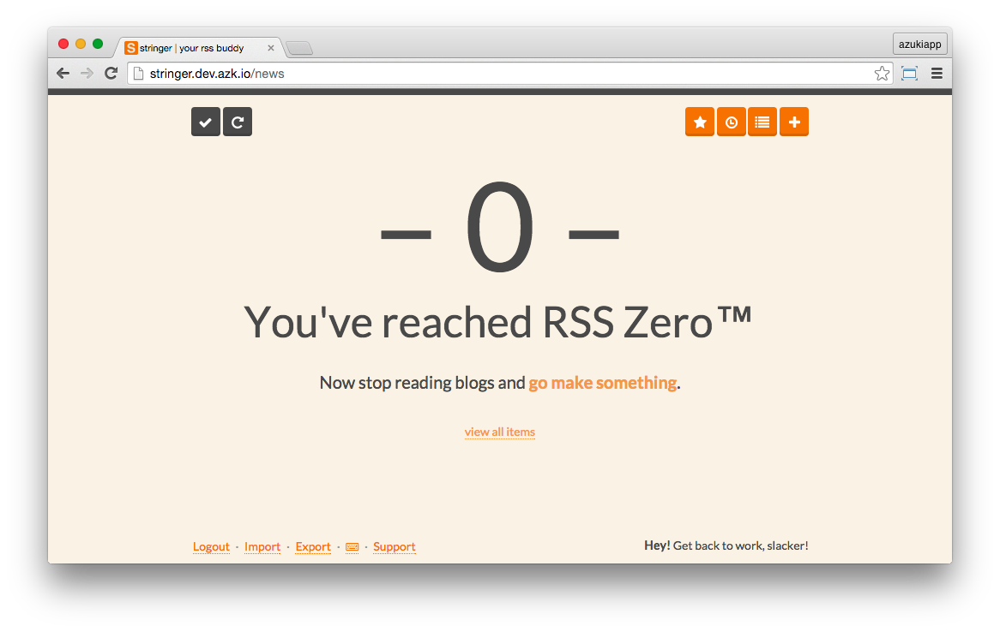
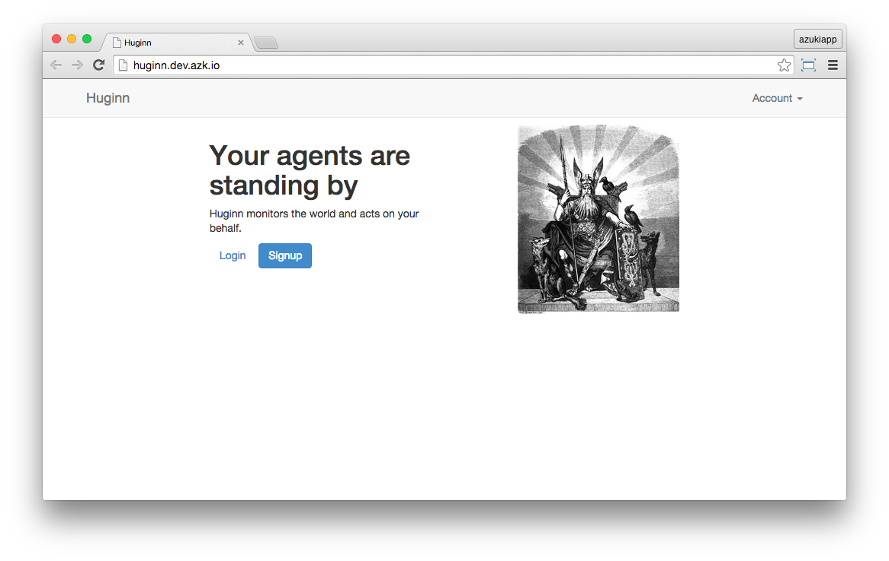
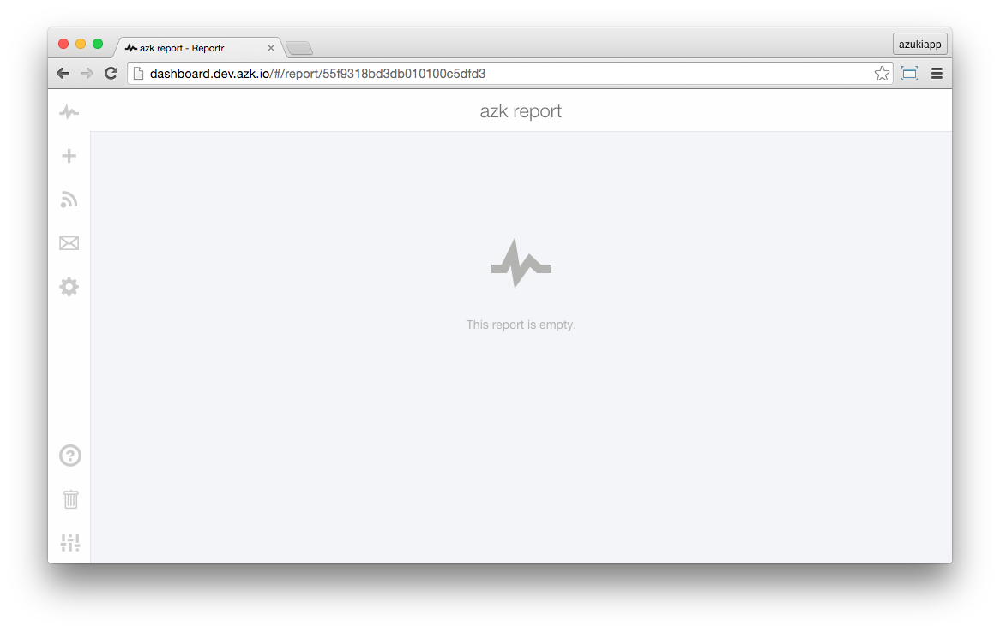

# `Run Project` button - Gallery

This gallery lists up to date forks of popular repos from GitHub. It was created to illustrate the use of the `Run Project` button added to each of them.

Click the button to quickly and safely install any of the projects on your local machine.

The `Run Project` button employs `azk`, a lightweight open source orchestration tool that will automatically isolate and configure the application's environment for you.

The addition of the button, references to its use on the README and the `azk` manifest file for each project are the only changes applied to these forks.

Learn more about `azk` [here](https://github.com/azukiapp/azk).

<!-- MarkdownTOC -->

- [Stringer](#stringer)
    + RSS reader
    + ruby, postgres, sinatra
- [Dillinger](#dillinger)
    + Markdown editor
    + node, express, ejs, angular, markdown-it
- [Huginn](#huginn)
    + Local agents
    + ruby, rails, mysql
- [Regexr](#regexr)
    + Regular expressions
    + node, ruby, compass, sass
- [Shout](#shout)
    + IRC client
    + node, express, socket.io, slate-irc
- [Reportr](#reportr)
    + Personal dashboard
    + node, mongo, redis, express, kue

<!-- /MarkdownTOC -->

----------------------

## [Stringer](https://github.com/run-project/stringer)

A self-hosted, anti-social RSS reader.

`ruby, postgres, sinatra`

----------------------

## [Dillinger](https://github.com/run-project/dillinger)

The last Markdown editor, ever.

`node, express, ejs, angular, markdown-it`

----------------------

## [Huginn](https://github.com/run-project/huginn)

Huginn is a system for building agents that perform automated tasks for you online.  They can read the web, watch for events, and take actions on your behalf.  Huginn's Agents create and consume events, propagating them along a directed graph.  Think of it as a hackable Yahoo! Pipes plus IFTTT on your own server.  You always know who has your data. You do.

`ruby, rails, mysql`

----------------------

## [Regexr](https://github.com/run-project/regexr)

RegExr is a HTML/JS based tool for creating, testing, and learning about Regular Expressions.

`node, ruby, compass, sass`

----------------------

## [Shout](https://github.com/run-project/shout)

Shout — The self-hosted web IRC client.

`node, express, socket.io, slate-irc`

----------------------

## [Reportr](https://github.com/run-project/reportr)

Your life's personal dashboard. [http://www.reportr.io](http://www.reportr.io)

`node, mongo, redis, express, kue`

----------------------

## License

"Azuki", "azk" and the Azuki logo are copyright (c) 2013-2015 Azuki Serviços de Internet LTDA.

**azk** source code is released under Apache 2 License.

Check LEGAL and LICENSE files for more information.
