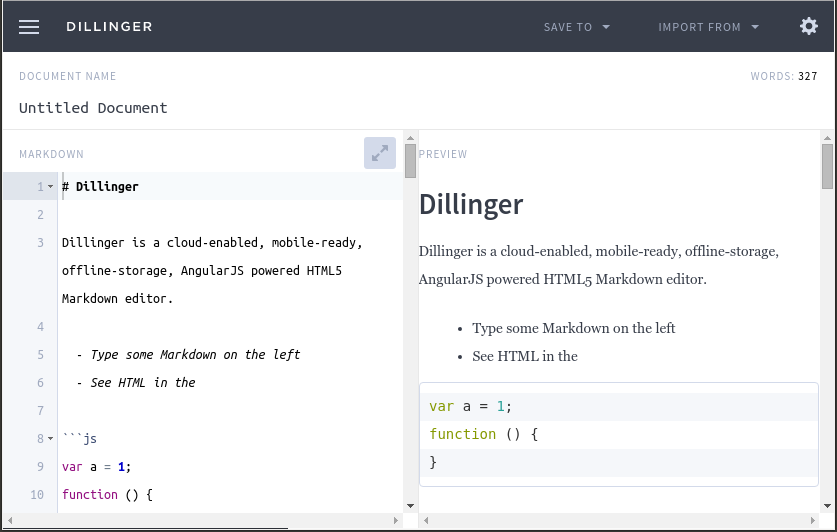
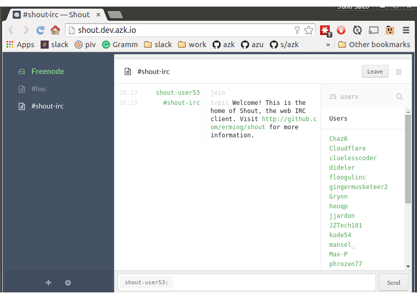

# Gallery - azk buttons

<!-- MarkdownTOC -->

- [Huginn](#huginn)
- [Isomorphic500](#isomorphic500)
- [Discourse](#discourse)
- [task-cerebral](#task-cerebral)
- [Feedbin](#feedbin)
- [Diaspora](#diaspora)
- [Jekyll](#jekyll)
- [lets-chat](#lets-chat)
- [Dillinger](#dillinger)
- [Habitica (HabitRPG)](#habitica-habitrpg)
- [Paperwork](#paperwork)
- [Rocket Chat](#rocket-chat)
- [Shout](#shout)

<!-- /MarkdownTOC -->


----------------------

### [Huginn](https://github.com/saitodisse/huginn/tree/azkfile)

<a href="https://github.com/saitodisse/huginn/tree/azkfile"></a>

Huginn is a system for building agents that perform automated tasks for you online.  They can read the web, watch for events, and take actions on your behalf.  Huginn's Agents create and consume events, propagating them along a directed graph.  Think of it as a hackable Yahoo! Pipes plus IFTTT on your own server.  You always know who has your data.  You do. Check [Azkfile.js](https://github.com/saitodisse/huginn/blob/azkfile/Azkfile.js) and [Azkfile.md](https://github.com/saitodisse/huginn/blob/azkfile/Azkfile.md) for more info.

```sh
azk start -o saitodisse/huginn#azkfile
```


----------------------

### [Isomorphic500](https://github.com/saitodisse/isomorphic500/tree/azkfile)

<a href="https://github.com/saitodisse/isomorphic500/tree/azkfile"></a>

[Isomorphic500](https://isomorphic500.herokuapp.com) is a small isomorphic ([universal](https://medium.com/@mjackson/universal-javascript-4761051b7ae9)) web application featuring photos from [500px](http://500px.com). It is built on [express](http://expressjs.com) using [React](https://facebook.github.io/react) and [Flux](https://facebook.github.io/flux) with [yahoo/fluxible](http://fluxible.io). It is developed with [webpack](http://webpack.github.io) and [react-hot-loader](http://gaearon.github.io/react-hot-loader/) and written with [babeljs](http://babeljs.io) with the help of [eslint](http://eslint.org). It supports multiple languages using [react-intl](http://formatjs.io/react/). Check [Azkfile.js](https://github.com/saitodisse/isomorphic500/blob/azkfile/Azkfile.js) and [Azkfile.md](https://github.com/saitodisse/isomorphic500/blob/azkfile/Azkfile.md) for more info.

```sh
azk start -o saitodisse/isomorphic500#azkfile
```


----------------------

### [Discourse](https://github.com/saitodisse/discourse/tree/feature/azkfile)

<a href="https://github.com/saitodisse/discourse/tree/feature/azkfile"></a>

Discourse is the 100% open source discussion platform built for the next decade of the Internet. It works as: a mailing list, a discussion forum or a long-form chat room; Check [Azkfile.js](https://github.com/saitodisse/discourse/blob/azkfile/Azkfile.js) and [Azkfile.md](https://github.com/saitodisse/discourse/blob/azkfile/Azkfile.md) for more info.

```sh
azk start -o saitodisse/discourse#feature/azkfile
```


----------------------

### [task-cerebral](https://github.com/saitodisse/task-cerebral)

<a href="https://github.com/saitodisse/task-cerebral"></a>

Simples list example using [cerebral controller](https://github.com/christianalfoni/cerebral). webpack/hot/dev-server enabled; production ready version on dist folder; exposes everything (app, DB) with ngrok; Check [Azkfile.js](https://github.com/saitodisse/task-cerebral/blob/master/Azkfile.js) and [Azkfile.md](https://github.com/saitodisse/task-cerebral/blob/master/Azkfile.md) for more info.

```sh
azk start -o saitodisse/task-cerebral
```


----------------------

### [Feedbin](https://github.com/azukiapp/feedbin/tree/azkfile)

<a href="https://github.com/azukiapp/feedbin/tree/azkfile"></a>

Feedbin is a simple, fast and nice looking RSS reader. Check [Azkfile.js](https://github.com/azukiapp/feedbin/blob/azkfile/Azkfile.js) and [Azkfile.md](https://github.com/azukiapp/feedbin/blob/azkfile/Azkfile.md) for more info.

```sh
azk start -o azukiapp/feedbin#azkfile
```


----------------------

### [Diaspora](https://github.com/fearenales/diaspora/tree/azkfile)

<a href="https://github.com/fearenales/diaspora/tree/azkfile"></a>

Distributed and contextual social networking.

```sh
azk start -o fearenales/diaspora#azkfile
```


----------------------

### [Jekyll](https://github.com/fearenales/jekyll)

<a href="https://github.com/fearenales/jekyll"></a>

Jekyll is a simple, blog-aware, static site generator perfect for personal, project, or organization sites. Think of it like a file-based CMS, without all the complexity. Jekyll takes your content, renders Markdown and Liquid templates, and spits out a complete, static website ready to be served by Apache, Nginx or another web server. Jekyll is the engine behind [GitHub Pages](http://pages.github.com/), which you can use to host sites right from your GitHub repositories.

```sh
azk start -o fearenales/jekyll
```


----------------------

### [lets-chat](https://github.com/saitodisse/lets-chat/tree/azkfile)

<a href="https://github.com/saitodisse/lets-chat/tree/azkfile"></a>

A self-hosted chat app for small teams built by [Security Compass][seccom]. Check [Azkfile.js](https://github.com/saitodisse/lets-chat/blob/azkfile/Azkfile.js) and [Azkfile.md](https://github.com/saitodisse/lets-chat/blob/azkfile/Azkfile.md) for more info.

```sh
azk start -o saitodisse/lets-chat#azkfile
```


----------------------

### [Dillinger](https://github.com/saitodisse/dillinger/tree/azkfile)

<a href="https://github.com/saitodisse/dillinger/tree/azkfile"></a>

The last Markdown editor, ever. Check [Azkfile.js](https://github.com/saitodisse/dillinger/blob/azkfile/Azkfile.js) and [Azkfile.md](https://github.com/saitodisse/dillinger/blob/azkfile/Azkfile.md) for more info.

```sh
azk start -o saitodisse/dillinger#azkfile
```


----------------------

### [Habitica (HabitRPG)](https://github.com/saitodisse/habitrpg/tree/azkfile)

<a href="https://github.com/saitodisse/habitrpg/tree/azkfile"></a>

A habit tracker app which treats your goals like a Role Playing Game. Check [Azkfile.js](https://github.com/saitodisse/habitrpg/blob/azkfile/Azkfile.js) and [Azkfile.md](https://github.com/saitodisse/habitrpg/blob/azkfile/Azkfile.md) for more info.

```sh
azk start -o saitodisse/habitrpg#azkfile
```


----------------------

### [Paperwork](https://github.com/saitodisse/paperwork/tree/azkfile)

<a href="https://github.com/saitodisse/paperwork/tree/azkfile"></a>

Paperwork - OpenSource note-taking & archiving alternative to Evernote, Microsoft OneNote & Google Keep. Check [Azkfile.js](https://github.com/saitodisse/paperwork/blob/azkfile/Azkfile.js) and [Azkfile.md](https://github.com/saitodisse/paperwork/blob/azkfile/Azkfile.md) for more info.

```sh
azk start -o saitodisse/paperwork#azkfile
```


----------------------

### [Rocket Chat](https://github.com/saitodisse/rocket-chat-azk)

<a href="https://github.com/saitodisse/rocket-chat-azk"></a>

Rocket Chat - The Complete Open Source Chat Solution. Check [Azkfile.js](https://github.com/saitodisse/rocket-chat-azk/blob/master/Azkfile.js).

```sh
azk start -o saitodisse/rocket-chat-azk
```


----------------------

### [Shout](https://github.com/saitodisse/shout)

<a href="https://github.com/saitodisse/shout"></a>

Shout — The self-hosted web IRC client. Check [Azkfile.js](https://github.com/saitodisse/shout/blob/azkfile/Azkfile.js) and [Azkfile.md](https://github.com/saitodisse/shout/blob/azkfile/Azkfile.md) for more info.

```sh
azk start -o saitodisse/shout
```
